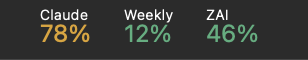

# Agent Usage Bar

Three agent-quota percentages, always in your macOS menu bar — nothing else.
The widget is a direct port of Stats' own "Mini" widget: a small caption on
top, the percent underneath, both left-aligned (not centered) — the shorter
line sits flush against the longer line's left edge, exactly like Stats.



| Box | Meter | Source |
| :--- | :--- | :--- |
| **ZAI** | Z.AI Coding Plan token quota | Z.AI quota endpoint |
| **Weekly** | Claude weekly (7-day) utilization | Claude Code OAuth usage endpoint |
| **Claude** | 5-hour session utilization | Claude Code OAuth usage endpoint |

This is the **macOS menu bar version** of
[agent-usage-widget](https://github.com/chunnytechmate/agent-usage-widget) —
re-built as three native Swift `NSStatusItem` widgets, reproducing
[Stats](https://github.com/exelban/stats)' own widget rendering
(`Kit/Widgets/Mini.swift`) instead of just taking inspiration from it: no
Electron, no dock icon, no window, ~0% idle CPU. If you only ever wanted the
percents, this replaces both the widget strip and your general-purpose stats
app.

ZAI, Weekly, and Claude are separate menu-bar boxes in that order (like
Stats' own sensors), each with its own tight two-line label-over-value
layout — clicking any one of them opens the same dropdown with all three
meters and settings.

Each percentage is severity-colored (green < 70, amber 70–89, red ≥ 90), with
monospaced digits so the bar never jitters as numbers change.

## Menu

Click the bar for details and controls:

- Each meter's full row — `Claude · 5-hour session  78%   resets 04:52 (3h 07m)`
- **Refresh Now** (⌘R)
- **Poll Interval** — 1 / 5 / 15 / 30 minutes (default 15 — Anthropic's usage
  endpoint isn't built for dashboard-grade polling and starts 429'ing well
  before a 5 min interval catches up; also re-polls a few seconds after the
  Mac wakes from sleep)
- **Launch at Login** (when running from the built `.app`)
- **Quit** (⌘Q)

Meters that can't be read show `–` in the bar, with the reason in their menu row
(e.g. *not signed in*). One meter failing never blanks the others.

## Setup

Requires Xcode Command Line Tools (Swift 6 / macOS 14+).

```sh
make app    # build + bundle + ad-hoc sign dist/AgentUsageBar.app
make open   # ...and open it
```

Or run straight from the binary (inherits your shell environment):

```sh
make run
```

To install properly, drag `dist/AgentUsageBar.app` to `/Applications`, then
enable **Launch at Login** from its menu.

### Auth

Exactly the credentials agent-usage-widget uses — nothing new is stored:

- **ZAI** — the key is resolved in this order:
  1. `ZAI_API_KEY` environment variable
  2. `~/.config/agent-usage-bar/env` containing `ZAI_API_KEY=sk-...`
     (use this when launching from Finder/Login Items, which see no shell env)
  3. the original widget's `.env` at `~/projects/agent-usage-widget/.env`
  4. `ANTHROPIC_AUTH_TOKEN` when `ANTHROPIC_BASE_URL` points at `z.ai` —
     the GLM Coding Plan key is the same key the quota endpoint wants, so a
     relay-configured Mac works with zero extra setup
- **Claude (Weekly, Claude)** — works automatically wherever Claude Code is
  signed in. The bar re-reads `~/.claude/.credentials.json` on every poll; if
  that file doesn't exist (current Claude Code builds keep the OAuth token in
  the login Keychain instead, under service `Claude Code-credentials`), it
  falls back to reading that via `security find-generic-password`. Relay
  setups (`ANTHROPIC_BASE_URL` + `ANTHROPIC_AUTH_TOKEN`) are attempted last,
  but most relays don't expose the usage endpoint — on those machines both
  boxes show *not signed in*.

Keys are only ever used for these two GET requests from your own machine.

## Files

| File | Purpose |
|------|---------|
| `Sources/AgentUsageBar/main.swift` | the whole app — providers, formatting, status item, menu |
| `Makefile` | `make app` / `make open` / `make run` |
| `scripts/render-preview.swift` | regenerates `docs/preview.png` (draws the real attributed string, no screenshot) |

## Credits

Endpoint logic ported from
[agent-usage-widget](https://github.com/chunnytechmate/agent-usage-widget)
(which was inspired by
[claude-usage-widget](https://github.com/niccolo-sabato/claude-usage-widget));
menu-bar app pattern in the spirit of [Stats](https://github.com/exelban/stats).
MIT license.
